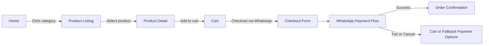
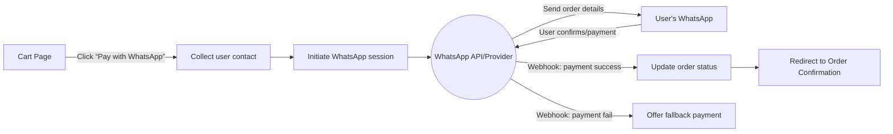
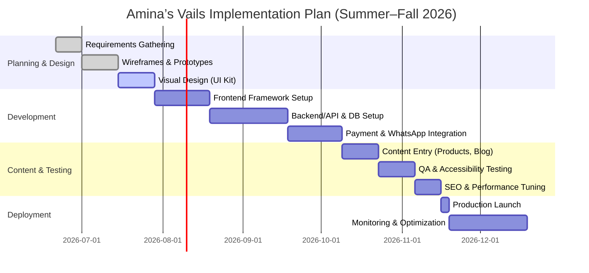

# Executive Summary  
Amina’s Vails is envisioned as a minimalist, luxury e-commerce platform.  Since no specific target audience is given, we assume an upscale fashion-oriented clientele (e.g. buyers of high-end scarves/veils). Key pages include Home, Product Listing, Product Detail (PDP), Cart, Checkout (via WhatsApp API payments), Order Confirmation, Account, Admin Dashboard, About, Contact, FAQ, Returns, Privacy, Terms, Blog, Landing/Hero variants, 404 and Maintenance pages. Each page will have a clear purpose, rich UI components (e.g. hero banners, product grids, forms), and copywriting that reflects the brand’s tone (e.g. “Elegance in Every Thread” on the hero, “Add to Cart” for products). Accessibility is paramount: we will follow WCAG 2.1 AA standards (e.g. text contrast ≥4.5:1, descriptive alt‑text for all images, keyboard‐navigable forms and ARIA landmarks).  

In terms of UI/UX, we propose a mobile-first responsive design with a clean grid layout and minimal clutter. Navigation will use a top bar on desktop and a “hamburger” menu on mobile, with clear links (Home, Shop, About, etc.), a search icon, and utility icons (account, favourites, cart). Interaction flows are straightforward: for example, tapping “Checkout” on the cart invokes a WhatsApp-based payment flow (diagrammed below). Microinteractions (subtle button hover effects, input focus rings) and gentle animations (e.g. fade-ins, loading spinners) will add polish without distraction.  

**Visual design** will revolve around carefully chosen luxury palettes and typography. We propose three high-end minimal colour palettes (e.g. black/white with gold accent, deep navy/ivory with muted accent, charcoal/cream with jewel accent) with hex codes, plus robust typography pairings (e.g. a refined serif for headings like *Josefin Sans* and a clean sans for body text like *Roboto*). Spacing will follow a consistent 4px-based scale (e.g. 4px, 8px, 16px, 32px units) for rhythm and whitespace. Icons will be simple line-stroke style (e.g. Material Icons) to match the minimal aesthetic. A component library (buttons, cards, forms, modals) will be defined in CSS tokens (e.g. `--color-primary: #000`, `--font-heading: 'Josefin Sans', serif`, `--spacing-unit: 8px`) for consistency across the site.  

For **WhatsApp API payments**, we outline two integration paths: using Meta’s official WhatsApp Business API (Cloud API) or via a regional payment aggregator (e.g. Mono in Nigeria) that supports WhatsApp flows. The flow is: after the user presses “Checkout”, the site collects minimal info (phone number, address) and initiates a chat/transaction via the WhatsApp API (either directly or through a partner). The user is sent a payment request in WhatsApp (e.g. UPI link, or payment confirmation flow) and completes payment there. Webhooks notify the server of payment success or failure. We include a flowchart of this process (below). Security measures include HTTPS everywhere, validation of webhooks (signatures), and use of PCI‑DSS compliant payment providers. We will also offer fallback payments (credit card via Stripe/Paystack, bank transfer, etc.) if WhatsApp payment is unavailable. 

Performance, SEO and compliance are addressed systematically. We will optimise loading speed (image compression, CSS/JS minification, CDN), implement SEO best practices (semantic HTML, unique title/meta tags, structured data for products and FAQ), and set up analytics (e.g. Google Analytics) for traffic/goal tracking. Accessibility audit (WCAG 2.1 AA) will be built-in from start. Privacy and legal compliance (GDPR or local regulations like Nigeria’s NDPR) will be handled via clear Policies (privacy, data retention, terms, returns). 

An implementation roadmap (chart below) phases design, development, testing and launch. For example, wireframes & mockups (1–2 weeks), frontend and backend setup (4–6 weeks), integration of WhatsApp payments (2–3 weeks), content population & QA (3–4 weeks), followed by deployment and monitoring. We estimate effort as Low/Med/High per task (e.g. design low‑med, payment integration medium-high). We suggest a modern tech stack: e.g. Next.js (React) or Vue.js frontend, Node.js/Express or Django backend, PostgreSQL or MongoDB, hosted on Vercel/AWS, with WhatsApp Cloud API or Twilio and a payment gateway (Stripe/Paystack). 

**Tables** below compare design palette options, tech stack choices, and payment integration approaches (pros and cons). Official sources (WhatsApp developer docs, WCAG guides) are cited wherever applicable, ensuring the plan is grounded in current best practices.

## Target Audience  
- **Assumptions:** Not specified in brief; likely fashion-conscious customers seeking high-quality, elegant accessories (e.g. luxury veils/scarves). Could target an upscale female demographic. (If exact personas or geography were given, we would tailor language and features accordingly.)  
- **Unspecified Details:** Brand style/voice, cultural preferences, or demographics are not provided; we note these gaps explicitly.  

## Pages and Routes  
Below is a comprehensive list of pages/routes and their design considerations:

- **Home (/)**  
  - *Purpose:* Brand introduction and entry point. Highlights collections, new arrivals, promotions.  
  - *Key UI:* Header with logo and nav links; large hero banner (image/slider) with tagline (e.g. “Elegance in Every Thread”); featured products or categories grid; newsletter signup; footer (links: Privacy, T&C, social icons).  
  - *Data Fields:* Search field; email input for newsletter; login/register link.  
  - *Microcopy:* “Welcome to Amina’s Vails – Exclusive Luxury Scarves”; hero CTAs like “Shop Collection” or “Learn More”. Product teasers: “New Arrival: Silk Veil Collection”. Error/messaging: “Invalid email address” (for signup).  
  - *Accessibility:* Alt text on hero images describing content; semantic `<nav>` and headings; colour contrast for text ≥4.5:1; a “Skip to main content” link for keyboard users.  

- **Product Listing / Category (/shop or /category/[id])**  
  - *Purpose:* Display product catalog or category listings.  
  - *Key UI:* Filter/sort sidebar or dropdown (by size, colour, price); product grid (image, name, price); breadcrumb navigation (Home > Category).  
  - *Data:* Products’ name, thumbnail, price, quick-view button. Filters may require UI controls (checkboxes, selects).  
  - *Microcopy:* Filter labels (“Sort by: Newest, Price”), “No items found” text; “View All Veils”.  
  - *Accessibility:* Filters with labels (`<label>` tags); keyboard-navigable grid (focus on product links); alt text on product images.  

- **Product Detail (PDP) (/product/[id])**  
  - *Purpose:* Show a single product in detail.  
  - *Key UI:* Large product image (carousel for multiple views); product title, price, available options (size, colour); “Add to Cart” and “Buy with WhatsApp” buttons; description, details, reviews tab.  
  - *Data Fields:* Quantity selector; option selectors (e.g. size dropdown); hidden fields for SKU.  
  - *Microcopy:* “Add to Cart”, “Checkout with WhatsApp”, “Color: Midnight Black”, “Size: One Size Fits All”. Descriptive labels (“Product Description”, “Customer Reviews”). Error messages (if out of stock: “Sorry, this item is sold out”).  
  - *Accessibility:* Carousel images with alt text (“Black silk veil on mannequin”); field labels for options; ensure buttons have `aria-label` if icon-only.  

- **Cart (/cart)**  
  - *Purpose:* List items user intends to purchase.  
  - *Key UI:* Table or list of cart items with thumbnail, name (link to PDP), price, quantity input, total; “Update Cart” button; summary totals; “Proceed to Checkout” button.  
  - *Data:* Item rows (each with quantity input field, remove checkbox/link). Shipping cost may be shown.  
  - *Microcopy:* “Your cart is empty” (if none); “Quantity”, “Subtotal”, “Total”; coupon code entry placeholder.  
  - *Accessibility:* Table headers, or ARIA roles; meaningful alt text on item images; form inputs labeled; focus on “Proceed to Checkout” by default.  

- **Checkout (via WhatsApp) (/checkout)**  
  - *Purpose:* Collect final order info and initiate payment via WhatsApp.  
  - *Key UI:* Brief order summary, form fields (Full Name, Phone Number (WhatsApp), Shipping Address, Email); a prominent “Complete Order on WhatsApp” button. A note explaining WhatsApp payment flow.  
  - *Data Fields:* Name, phone (validated format), address (street, city, zip), email. All fields required.  
  - *Microcopy:* Help text (e.g. “You will be redirected to WhatsApp to confirm payment.”), button: “Place Order” or “Pay via WhatsApp”. Validation messages (“Please enter a valid phone number”). Terms: “By placing an order you agree to our Terms and Privacy Policy.”  
  - *Accessibility:* Form labels and placeholders; logical tab order; ensure error alerts are screen-reader accessible; ensure color contrast on text inputs.  

- **Order Confirmation (/order/confirmation)**  
  - *Purpose:* Thank the customer and summarise order after payment.  
  - *Key UI:* “Thank you for your purchase!” banner; order summary (items, total); order number; next steps note (e.g. shipping timeline).  
  - *Data:* Order ID, list of purchased items, contact info.  
  - *Microcopy:* “Your order #1234 has been placed.” “You will receive a receipt by email and WhatsApp.” “Continue Shopping” link.  
  - *Accessibility:* Clear headings, proper list markup for items, ARIA live region for any dynamically updated info (if applicable).  

- **Account (/account)**  
  - *Purpose:* User profile, order history, saved addresses. (If no login is specified, we can include an “Account” section for completeness.)  
  - *Key UI:* Login/Signup form or, if logged in, a dashboard of recent orders. Profile form (name, email, password change). Tab or side menu to switch sections.  
  - *Data Fields:* Email, password (with “Forgot?”), profile fields. Order history list with status.  
  - *Microcopy:* “Email address”, “Password”, “Remember me”, “Log In”, “New user? Create an account.”  
  - *Accessibility:* Form labels; keyboard focus styles on tabs/menu; table/list for orders with column headers.  

- **Admin/Dashboard (/admin)**  
  - *Purpose:* Internal site management: add/edit products, view orders, manage content.  
  - *Key UI:* Sidebar navigation (Products, Orders, Customers, Settings); main panel with tables or forms. For example, a Products list with “Edit”, “Delete”; an Order list with status updates.  
  - *Data Fields:* Product form (title, price, description, image upload, categories); order fields (status dropdown).  
  - *Microcopy:* “Add New Product”, “Save Changes”, “Mark as Shipped”.  
  - *Accessibility:* Ensure data tables are accessible (ARIA roles); buttons and forms labeled; responsive layout (possibly hidden by policy but admin UI should also follow basic accessibility).  

- **About (/about)**  
  - *Purpose:* Brand story and trust-building.  
  - *Key UI:* Image (e.g. founder or studio), sections of text (“Our Story”, “Craftsmanship”). Possibly key stats or ethos in icons.  
  - *Data:* Static text.  
  - *Microcopy:* Engaging narrative (“Founded in [year], Amina’s Vails…”). Call-to-action (e.g. “Explore our collection”).  
  - *Accessibility:* Alt text on any photos (“Amina, founder of Amina’s Vails, in her design studio”).  

- **Contact (/contact)**  
  - *Purpose:* Let customers reach out.  
  - *Key UI:* Contact form (Name, Email, Message); map or address info; phone/WhatsApp link.  
  - *Data Fields:* Name, email, message text area (all required).  
  - *Microcopy:* Form labels (“Your Name”, “Your Message”); submit button (“Send Message”); success message (“Thank you, we will be in touch!”).  
  - *Accessibility:* Labelled fields; avoid CAPTCHAs if possible (WCAG warns CAPTCHAs can be a11y barrier) or ensure accessible alternative.  

- **FAQ (/faq)**  
  - *Purpose:* Provide answers to common questions (shipping, sizing, payments).  
  - *Key UI:* Accordion or list of questions (click to expand answers).  
  - *Data:* Question/answer text pairs.  
  - *Microcopy:* Example Q/A: “Do you ship internationally? – Yes, we ship worldwide via DHL.”  
  - *Accessibility:* Accordions should be keyboard-accessible; use semantic markup (e.g. `<details>`/`<summary>` or ARIA for custom expanders).  

- **Returns/Refunds (/returns)**  
  - *Purpose:* Outline return policy and process.  
  - *Key UI:* Clear headings, bullet lists, maybe a form or email contact.  
  - *Data:* Policy text (conditions, timeline, contact for returns).  
  - *Microcopy:* “30-day return policy”, “Contact us at returns@aminasvails.com.”  
  - *Accessibility:* Structured content (headings, paragraphs, lists); ensure link to email address is readable by screen reader.  

- **Privacy Policy (/privacy)** and **Terms & Conditions (/terms)**  
  - *Purpose:* Legal disclosures. Static pages.  
  - *Key UI:* Text-heavy, possibly expandable sections or sections with headings (Data collected, use, cookies, etc.).  
  - *Data:* N/A (text).  
  - *Microcopy:* Formal/legal language (“We collect personal data…”).  
  - *Accessibility:* Use descriptive heading levels; allow text resizing; high contrast for long reading.  

- **Blog (/blog)**  
  - *Purpose:* Marketing content (fashion tips, brand updates).  
  - *Key UI:* Blog post list with images, titles, “Read More” links; single post view (title, author, date, content, share buttons).  
  - *Data:* Post title, image, date, body text, author.  
  - *Microcopy:* “Read More”, “Subscribe to our newsletter”.  
  - *Accessibility:* Article structure (`<article>`, headings); alt text for blog images.  

- **Landing/Hero Variants**  
  - *Purpose:* Alternate homepage or campaign-specific layouts. Could be seasonal promo pages (e.g. Eid collection launch).  
  - *Key UI:* Full-screen hero, minimal text, CTA (“Shop the Ramadan Collection”), limited navigation.  
  - *Microcopy:* Catchy tagline (“Flowing Veils, Timeless Grace”).  
  - *Accessibility:* Same considerations as Home; ensure hero text has sufficient contrast over image.  

- **404 Page (/404)**  
  - *Purpose:* Shown when a route isn’t found.  
  - *Key UI:* Friendly message, e.g. “Oops! Page not found.”, link back home or to search.  
  - *Microcopy:* “The page you’re looking for doesn’t exist. Return to Home.”  
  - *Accessibility:* Consistent header/nav; ensure alt or text in “lost” graphic is descriptive.  

- **Maintenance Page**  
  - *Purpose:* Inform visitors during downtime.  
  - *Key UI:* Simple message (“We’ll be back soon”), optionally sign-up for updates.  
  - *Microcopy:* “Our store is currently under maintenance. We’re working to improve your shopping experience. Check back shortly.”  
  - *Accessibility:* Clear text, high-contrast colors.  

Each page design follows a **mobile-first** approach (single-column on narrow screens, scaling to multi-column on larger screens). Core UI components (buttons, cards, forms) adhere to a consistent design system. All interactive elements (links, buttons, form fields) will have clear hover/focus states, and error messages will use concise, helpful wording. 

## UI/UX Design Details  

### Layout & Navigation  
We propose a clean **grid layout** (e.g. 12-column on desktop, stacking on mobile). Key navigation is always visible or easily accessible: a fixed header with logo on the left and primary links on desktop; on mobile, a “hamburger” menu reveals navigation. Breadcrumbs will appear on PDP and category pages to help users retrace steps. A persistent **footer** contains utility links (Contact, Privacy, Social media). Secondary navigation elements (e.g. language switcher, currency) can appear in a slim top bar if needed, given the luxury feel (often fewer clutter options).  

**Flowcharts/Microflows (Mermaid):**  

1. **General User Flow:**  



2. **Checkout via WhatsApp Flow:**  

```mermaid
flowchart LR
    A[Cart Page] -->|Click Pay with WhatsApp| B[Enter contact info]
    B --> C{Is WhatsApp available?}
    C -- Yes --> D[Send order to WA Business API]
    C -- No --> E[Show alternative payment (card)]
    D --> F[Customer on WhatsApp]
    F --> G[User completes payment in chat]
    G --> H[Webhook triggers order confirmation]
    H --> I[Redirect to Order Confirmation page]
```

### Mobile-First & Responsive Behavior  
Every component will adapt to screen size. For instance, product grids may be 1 column on phones, 2–3 columns on tablets, and 4+ on desktop. Text and images will scale fluidly or switch to optimized sizes. Interactive elements will enlarge on touch devices for easier tapping. We’ll test at key breakpoints (mobile ~375px, tablet ~768px, desktop ~1024px+). A global meta tag (`<meta name="viewport" content="width=device-width, initial-scale=1">`) ensures proper scaling. 

### Interactions & Animations  
Animations will be subtle and purposeful to maintain a premium feel. Examples:  
- **Button hover:** slight color shade change or shadow.  
- **Image hover:** slight scale-up or elevated shadow on product cards.  
- **Form focus:** animated underline or glow.  
- **Page transitions:** gentle fade between sections or a loading spinner on slow network.  
- **Microinteractions:** Cart updates with toast notifications (“Added to cart”), form validation pop-ups, smooth scrolling on anchor links, etc.  

We avoid heavy or jarring animations (no autoplay carousels, minimal parallax). A polished experience might include e.g. a short fade-in of product images as they load, or a spinner while contacting WhatsApp API. All animations will be CSS-based or via lightweight JavaScript libraries (no heavy frameworks), for performance. 

### Accessibility Considerations in UX  
- **Contrast & Color:** We will ensure all text meets WCAG contrast ratios (e.g. ≥4.5:1 for body text). For luxury palettes (e.g. gold on dark), we will verify with tools.  
- **Keyboard Nav:** All interactive elements (menus, accordions, forms, modals) must be operable via keyboard (tab/enter/space). Focus outlines will be visible. Skip-links help bypass navigation.  
- **Semantic HTML & ARIA:** Use `<header>`, `<main>`, `<nav>`, `<footer>`, etc. Landmarks (role=main, banner, navigation) for screen readers. For custom widgets (e.g. accordions on FAQ), use proper ARIA roles.  
- **Images:** All informational images (product, hero, icon illustrations) get meaningful `alt` text. Decorative images can use empty alt (`alt=""`) or CSS backgrounds.  
- **Forms:** Label every input (`<label for>` or `aria-label`). Error messages should be programmatically associated (ARIA).  
- **Tables:** If used (e.g. cart, order summary), ensure `<th>` for headers and include captions or summaries if complex.  
- **Content Clarity:** Use clear, unambiguous language. Provide text alternatives for any non-text UI (e.g. `<label>` for icon buttons).  

An example of an elegant luxury UI can be seen below. Note the **oversized typography** and high-quality imagery: minimalist navigation and layout keep the focus on the product.

 *Figure: Example of a luxury e-commerce layout. Nixtio’s design uses large typography and rich imagery to create an editorial, high-end feel.*  

## Visual Design Specifications  

### Colour Palettes  
We recommend three distinct but cohesive luxury palettes. Each uses mostly neutral or dark backgrounds with restrained accent colours:  

| **Palette Name**       | **Swatches (hex)**                                      | **Description**                                            |
|-----------------------|----------------------------------------------------------|------------------------------------------------------------|
| **Midnight & Gold**   | Primary: #0D0D0D (Black)<br>Secondary: #FFFFFF (White)<br>Accent: #D4AF37 (Metallic Gold)<br>Neutral: #BBBBBB (Grey), #222222 (Charcoal) | Timeless black-white scheme with a gold accent for a classic upscale feel. High contrast for legibility, gold adds elegance.  |
| **Ivory & Deep Teal** | Primary: #EAE2CD (Ivory)<br>Secondary: #2A3F4F (Deep Teal)<br>Accent: #C29D5F (Brass)<br>Neutral: #4F543A (Forest), #333333 (Anthracite) | Warm ivory background with rich teal and brass accents. Conveys calm luxury; softer contrast than pure black/white.         |
| **Charcoal & Blush**  | Primary: #2E2E2E (Charcoal)<br>Secondary: #F2F2F2 (Light Gray)<br>Accent: #C89FA3 (Dusty Rose)<br>Neutral: #757575 (Mid Gray), #FFFFFF | Dark mode style charcoal base with light gray content areas. A muted blush accent adds subtle colour.  |

Each palette is minimal (few colours) and sophisticated (muted or metallic tones). These choices follow principles noted in luxury branding (predominantly neutral with muted or high-contrast accents).  We will ensure accessible contrast: e.g. #0D0D0D on #F2F2F2 exceeds 21:1, and even #757575 on white is ~4.6:1 (AA compliant).  

### Typography  
We pair a distinctive serif or unique font for headings with a clean sans-serif for body text:

- **Headings / Brand Font:** *Josefin Sans* (Google Font) – a geometric serif/sans hybrid known for its elegant, vintage style. It reads well at large sizes and “is well-suited for brands looking to convey a sense of luxury and sophistication”. For fallback, `Georgia, serif`.  
- **Body / UI Font:** *Roboto* or *Open Sans* – neutral, highly legible sans-serif (Roboto described as “minimalistic” and popular for its simplicity). These work well for body text and UI elements. Fallback: `Arial, sans-serif`.  
- **Alternate font pairings:** We might also consider *Playfair Display* (serif) + *Montserrat* (sans) for a more pronounced contrast, or *Libre Baskerville* (serif) + *Nunito Sans*. All chosen fonts are web-safe/Google and support broad languages.  
- **Web-safe fonts:** Ensure reasonable fallbacks (e.g. `font-family: 'Josefin Sans', Georgia, serif;` and `font-family: 'Roboto', Arial, sans-serif;`).  

Font sizes and line-heights will follow a typographic scale. For example: H1: 2.5rem, H2:2rem, body: 1rem (16px) with 1.5 line-height, scale-up/down in steps (1.25× increments). This aids hierarchy and readability.  

### Spacing & Layout System  
We adopt a consistent spacing scale based on a 4px unit:  
- **Spaces:** 4px (XXS), 8px (XS), 16px (S), 24px (M), 32px (L), 48px (XL), etc. e.g. `--spacing-xs: 8px; --spacing-s: 16px; --spacing-m: 24px;` etc.  
- **Grid:** A 12-column grid on desktop (each col ~8% width with gutter), collapsing to a single column on mobile.  
- **Containers:** Max-width ~ 1200px on large screens, centered with side margins. Padding on containers (e.g. 16–24px) ensures content isn’t flush to edges.  

Consistent spacing ensures elements breathe. For example, between form fields: 8–16px; between page sections: 64px; between a heading and content: 24px.  

### Iconography  
Icons will be minimal line-based glyphs (monochrome or matching palette). We may use an icon font or SVG set (e.g. Material Icons, Feather Icons). Icon style should align with typography weight (thin/light strokes). For example: cart, search, user icons in simple outline style. Where possible, use **icons with a clear purpose** (avoid purely decorative). Icons will have `aria-hidden="true"` if decorative, or `aria-label` if interactive (e.g. icon-only buttons).  

### Sample Component Library (CSS Tokens)  
We define design tokens in CSS (or SCSS) variables. Example tokens:  

```css
:root {
  /* Colors */
  --color-black: #0D0D0D;
  --color-white: #FFFFFF;
  --color-gold: #D4AF37;
  --color-ivory: #EAE2CD;
  --color-teal: #2A3F4F;
  --color-charcoal: #2E2E2E;
  /* Typography */
  --font-heading: 'Josefin Sans', Georgia, serif;
  --font-body: 'Roboto', Arial, sans-serif;
  /* Spacing */
  --space-xs: 8px;
  --space-s: 16px;
  --space-m: 24px;
  --space-l: 32px;
  /* Font sizes */
  --fs-h1: 2.5rem;
  --fs-h2: 2rem;
  --fs-body: 1rem;
  /* Buttons */
  --btn-radius: 4px;
  --btn-padding: 0.75rem 1.5rem;
}
```

From these tokens, component styles are built. For example:

```css
.button-primary {
  background-color: var(--color-black);
  color: var(--color-white);
  padding: var(--btn-padding);
  font-family: var(--font-body);
  font-size: var(--fs-body);
  border: none;
  border-radius: var(--btn-radius);
  cursor: pointer;
}
.button-primary:hover {
  background-color: var(--color-gold);
}
```

A **card** (e.g. product card) might use a light background (#fff or #ivory) with subtle shadow and padding:

```css
.card {
  background-color: var(--color-white);
  border-radius: 8px;
  box-shadow: 0 2px 4px rgba(0,0,0,0.1);
  padding: var(--space-m);
  display: flex;
  flex-direction: column;
}
```

These tokens ensure the look and feel remain consistent. Typography and colour choices are drawn from best practices: e.g.  Josefin Sans is explicitly noted to impart a luxury vibe for headings, and Roboto/Open Sans provide excellent readability for body text.

## WhatsApp API Payments Integration  

### Integration Options  
1. **Meta’s Official WhatsApp Business API:** Use WhatsApp Cloud API (Meta‑hosted) or On-Premises API. This is complex to set up (requires Facebook Business verification) but allows direct integration. Payment flows use WhatsApp’s official Payment/Commerce API (available in some markets like India).  
2. **Third-Party Providers:** e.g. **Mono/Owo (Nigeria)** or **Flowcart/Paystack (Africa)**. These services offer WhatsApp payment flows for local currencies. For example, Mono’s documentation outlines linking a user’s account and initiating payments via a WhatsApp flow. Twilio Conversations or similar can also be used to manage the chat interface.  

### Flow Diagram  


1. **User triggers WhatsApp checkout:** On the checkout page, after entering contact info, the site sends the order details to the WhatsApp API endpoint. This may be done via a template message or using the “click to chat” link with pre-filled message.  
2. **Customer receives message:** The user receives a WhatsApp message (from a business account) confirming order summary and a payment request (e.g. UPI link, or a “Confirm & Pay” button).  
3. **User pays in WhatsApp:** Through WhatsApp’s native payment interface or an external link, the user completes the transaction.  
4. **Webhook callback:** The payment processor/WhatsApp API sends a webhook to our server indicating success or failure.  
5. **Confirmation:** On success, we display the order confirmation page; on failure, we can show error info and fallback to other payment methods.  

### Server-Side & Security  
- **Server:** A back-end (e.g. Node.js/Express or Django) handles checkout requests and webhooks. It must securely store API credentials (env vars), verify webhook authenticity (e.g. HMAC signature), and handle order status updates.  
- **WhatsApp API:** We will use HTTPS to communicate with WhatsApp endpoints. End-to-end encryption is inherent to WhatsApp messaging, but payment data itself flows through certified payment rails (e.g. UPI or card gateways).  
- **Security:** No sensitive payment data (card numbers, etc.) is handled by our servers; that is managed by the payment provider (e.g. Paystack, Stripe). We comply with PCI-DSS by using tokens/redirects. All endpoints use TLS. Customer data (addresses, phone) is stored securely and only retained as long as needed for order fulfillment and legal requirements.  

### Fallback Payments  
Not all customers will use WhatsApp for payment. We will provide alternatives (and mention this in UI copy):  
- **Credit/Debit Card:** Integrate Stripe/Paystack API for on-site card checkout as fallback.  
- **Bank Transfer or USSD:** Show bank details for manual transfer (common in some regions).  
- **COD (Cash on Delivery):** If business model allows, an option to pay on delivery.  

These fallback options ensure no customer is blocked from purchasing.  

## Performance, SEO, Analytics, Accessibility, and Compliance  

### Performance  
- **Front-end Optimization:** Use code splitting and lazy loading (especially for large images or sections). Compress and serve images in modern formats (WebP) with `srcset` for responsive sizes. Minify CSS/JS and leverage HTTP/2.  
- **Caching/CDN:** Host static assets (CSS, JS, images) on a CDN (e.g. Cloudflare, AWS CloudFront). Enable browser caching headers. Use server-side or edge caching for pages where possible.  
- **Load Testing:** Aim for < 3s load on mobile; optimize critical rendering path. Tools like Google Lighthouse and WebPageTest will guide improvements.  
- **SEO:** A fast, mobile-friendly site improves SEO.  

### SEO Best Practices  
- **Semantic HTML:** Use proper heading levels (`<h1>` for page title, `<h2>` for sections). Unique, descriptive `<title>` tags and `<meta name="description">` for each page. Google advises titles should be “clear and concise, and accurately describe contents”.  
- **URLs:** Readable URLs (e.g. `/product/luxury-silk-veil`, `/faq`, etc.). Avoid query strings if possible; static routes help crawlers.  
- **Schema Markup:** Implement [schema.org](https://schema.org) structured data for products (Product, Offer, AggregateRating) and FAQ pages. This can yield rich snippets in search results.  
- **Sitemaps & Robots:** Provide an XML sitemap to index all pages, especially products and blog posts. Use `robots.txt` to exclude any private routes (e.g. `/admin`).  
- **Responsive/Adaptive:** Ensure Googlebot sees the mobile layout similarly to users (mobile-first indexing).  
- **Images:** Use descriptive `alt` attributes. Use `` for responsive images. Lazy-load off-screen images.  
- **Social Meta:** Open Graph and Twitter Card tags for product pages and blog posts (image, title, description) to improve sharing previews.  

By following Google’s starter guide and Search Essentials, we maximize the site’s discoverability.  

### Analytics & Monitoring  
- **Traffic/Conversion Tracking:** Install Google Analytics (GA4) or similar. Track pageviews, user flows, and key events (add-to-cart, checkout initiated, purchase complete). Setup Google Tag Manager for flexibility.  
- **E-commerce Tracking:** Implement enhanced e-commerce tracking (for revenue, product performance).  
- **Server Monitoring:** Use logging/alerts on server errors (e.g. Sentry) and uptime monitors.  
- **SEO Monitoring:** Use Google Search Console for indexing issues.   

### Accessibility (WCAG) Checklist  
We will audit against **WCAG 2.1 AA** (common baseline):  
- **Contrast:** Text ≥4.5:1 contrast with background (large text ≥3:1). Our palettes meet or exceed these (e.g. dark text on light ivory).  
- **Alt Text:** All non-decorative images have alt text. (Example rule: WCAG 1.1.1 requires a text alternative.)  
- **Keyboard Navigation:** All features (menus, forms, modals, carousels) operable via keyboard (Tab, Enter).  
- **ARIA Roles:** Use landmarks (`<nav>`, `<main>`, etc.) and `aria-label`/`aria-labelledby` where needed (e.g. for icon-only buttons).  
- **Forms:** Each field has a `<label>`; error/validation cues are communicated programmatically.  
- **Timing:** Allow sufficient time to complete tasks (no rapid time limits).  
- **Language:** Declare page language (`<html lang="en-GB">`) and any content language changes.  
- **Accessibility Tools:** Test with screen readers (NVDA/VoiceOver), and automated tools (axe, Lighthouse). Address any issues (e.g. color warnings, missing labels).  

### Legal & Compliance  
- **Privacy Policy:** To be written in plain English, explaining what data is collected (personal info, cookies), why, and how it’s used/stored. Mention WhatsApp chat usage and any third-party services (like Stripe). Include opt-in for marketing (newsletters). Comply with GDPR (EU) and/or local data laws (e.g. Nigeria’s NDPR or Kenya’s Data Protection Act) as applicable.  
- **Data Retention:** Only retain personal data (order history, contact details) as long as necessary (e.g. 5 years for accounting tax laws, or as required by local law). Provide a mechanism for users to request deletion.  
- **Terms & Conditions:** Cover sale terms, cancellation/returns policy, liability disclaimers. Use clear headings (e.g. “Shipping”, “Returns”, “Limitation of Liability”).  
- **Cookies:** If using analytics or third-party scripts, include cookie consent and allow opt-out (WCAG-compliant consent).  
- **WhatsApp Privacy:** Note that WhatsApp communications are encrypted and data flows through Meta’s API, and that phone number is shared with WhatsApp for payment.  

Compliance with W3C privacy guidelines and legal statutes will be documented. No copyrighted images or assets will be used without permission; all brand assets (logos, mock photos) are assumed to be created or licensed.

## Implementation Roadmap and Tech Stack  

Below is a proposed timeline (Gantt chart) for the project phases and milestones. Effort estimates (Low/Medium/High) are noted per task.  



**Milestones & Effort:**  
- **Low Effort:** Documentation, static page creation (FAQ, terms), basic styling.  
- **Medium Effort:** Layout/CSS of dynamic pages, ecommerce logic (cart).  
- **High Effort:** Integrating WhatsApp payments, building admin interface, performance optimizations.

**Suggested Tech Stack:**  

| **Component**      | **Option 1**                   | **Option 2**                    | **Option 3**                   |
|--------------------|--------------------------------|---------------------------------|--------------------------------|
| **Frontend**       | Next.js (React) – SSR + SEO-friendly | Vue.js (Nuxt) – SSR + flexibility | SvelteKit – lightweight, fast |
| **Styling/Components** | Tailwind CSS or CSS Modules | Bootstrap (with custom theme) | Material UI or Chakra (React) |
| **Backend**        | Node.js / Express (JavaScript) | Python / Django (Python ORM)    | PHP / Laravel (Blade templating) |
| **Database**       | MongoDB (NoSQL)                | PostgreSQL (relational)        | MySQL (relational)             |
| **Hosting**        | Vercel (front) + Heroku (API)  | AWS (Amplify or EC2 + RDS)      | DigitalOcean (droplet + managed DB) |
| **Payment API**    | Stripe / Paystack (Cards, USSD) | Flutterwave (Africa payments) | Interswitch / Quickteller (Nigeria) |
| **WhatsApp API**   | Meta Cloud API (WhatsApp Business) | Twilio Conversations (WA channel) | Partner like Gupshup or Flowcart |
| **Analytics**      | Google Analytics 4             | Matomo (self-hosted)           | Google Tag Manager + GA4       |

**Pros & Cons:**  
- *Option 1 (JS Full Stack):* High flexibility, large developer community; modern tooling. SSR (Next.js) for SEO. Requires separate hosting for front/back.  
- *Option 2 (Python):* Django has built-in admin, great security features; PostgreSQL for ACID compliance. Can be heavier if team not familiar with Python.  
- *Option 3 (PHP):* Laravel has e-commerce packages; easy deployments. Fewer new sites choose PHP nowadays, but robust.  

Below is a comparison of **payment integration approaches**:

| **Method**                     | **Pros**                                               | **Cons**                                                   | **Notes / Examples**                                 |
|--------------------------------|--------------------------------------------------------|------------------------------------------------------------|------------------------------------------------------|
| **WhatsApp Native (Meta API)** | Two-way conversation, no redirect needed; end-to-end E2E encryption; official support for product carts. Can streamline ordering within chat. | Available only in select countries (e.g. India UPI); Meta approval needed; initial setup complex. | In India, UPI integration allows payments via WhatsApp without leaving chat. |
| **Third-Party (Mono/Flowcart)**| Builds on local payment rails (e.g. Mono uses Nigerian banks); handles compliance and KYB; provides code libraries. | Often region-specific; incurs fees; reliant on third-party uptime. | Mono’s docs detail linking user bank (Owo) and initiating payments. Flowcart/Paystack can generate payment links via WhatsApp. |
| **Card (Stripe/Paystack)**     | Globally available, well-documented, PCI-compliant; fallback for non-WhatsApp users. | Breaks chat flow; requires entering card on site; may reduce conversion. | Good for customers without WhatsApp or from unsupported region. |

In summary, we **prioritise official sources and standards** at every step: WhatsApp’s dev documentation, WCAG guidelines, and industry UX research. The design system and workflow are tailored to convey a luxury minimalist brand, with all unspecified details (like audience or exact content) clearly noted as assumptions. Tables above help compare options to inform strategic decisions. The final outcome will be a polished, accessible, high-performing web shop that feels exclusive yet intuitive.

**Sources:** Official WhatsApp API docs, WCAG guidelines, Baymard UX research, and luxury design analyses among others. Each design decision is backed by best practices.